# SW-GCN

# Main page of Graph Convolutional Networks Skeleton-Based Action Recognition for Continuous Data Stream : A Sliding Window Approach done by [ESIGELEC](https://www.esigelec.fr/) and [SIATECH](https://www.siatech.fr/)

 

## Abstract :

This paper introduces a novel deep learning based approach to human activity recognition. The method consists of a Spatio-Temporal Graph Convolutional Network  operating in real time thanks to a sliding window approach. The proposed architecture consists of a fixed window for train, validation and test process with a Spatio-Temporal-Graph Convolutional Network for skeleton-based action recognition. We evaluate our architecture on two available datasets of common continuous stream action recognition, the Online Action Detection dataset and UOW Online Action 3D datasets. This method is used for temporal detection and classification of the performed action recognition in real time.

## OAD dataset

### Confusion matrix and statistics of Validation for OAD dataset : 

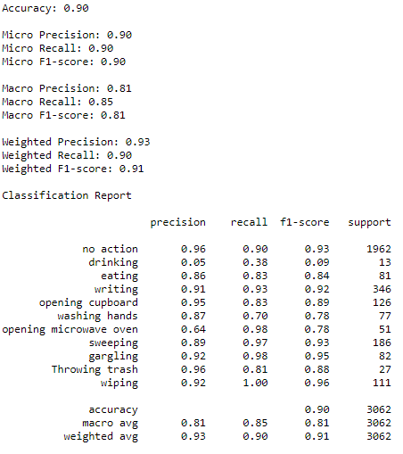

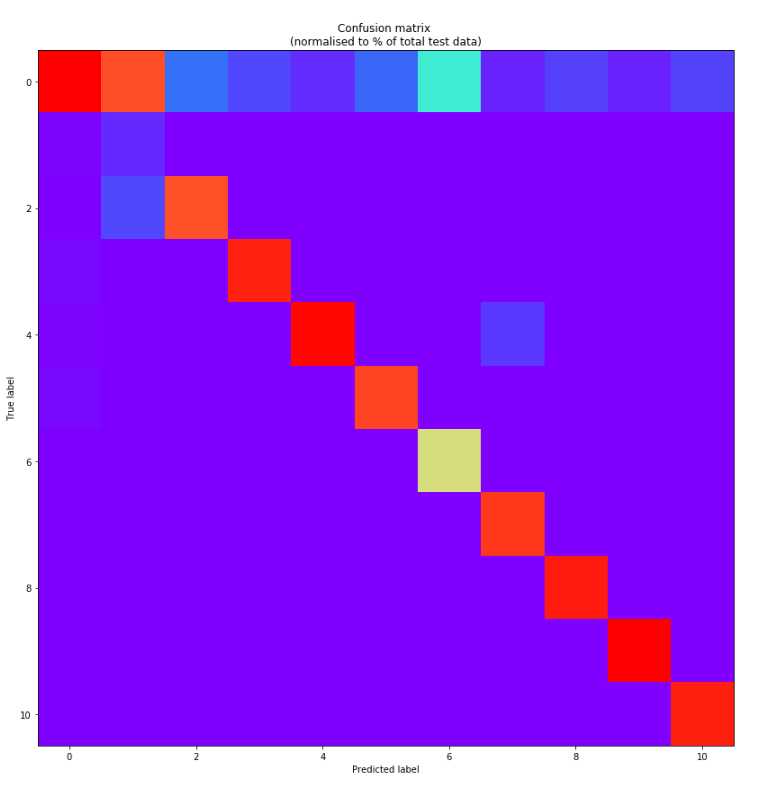

### Confusion matrix and statistics of Test for OAD dataset : 

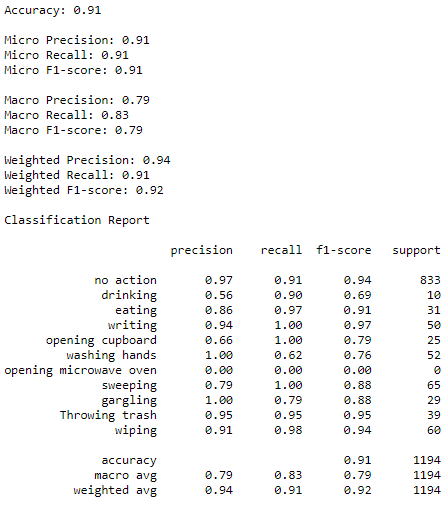

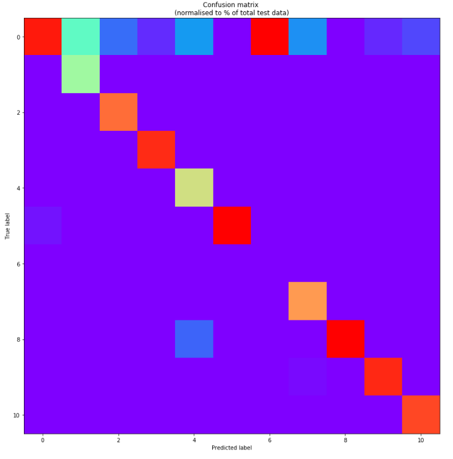

## UOW dataset
### SW-GCN method
### Confusion matrix and statistics of Validation for UOW dataset : 

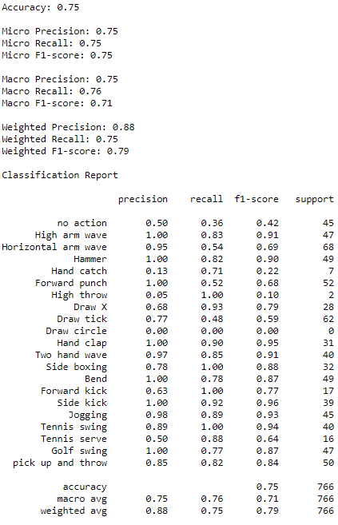

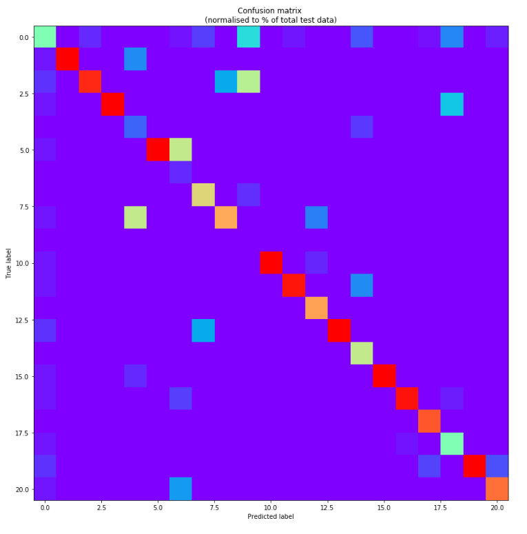

### Confusion matrix and statistics of Test for UOW dataset : 

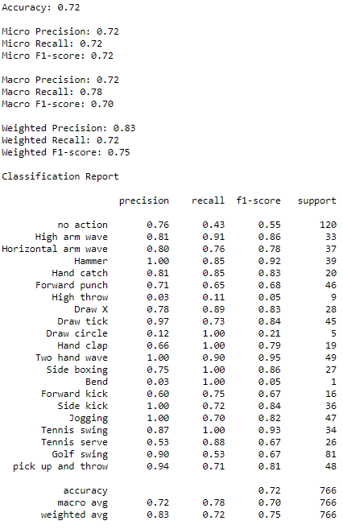

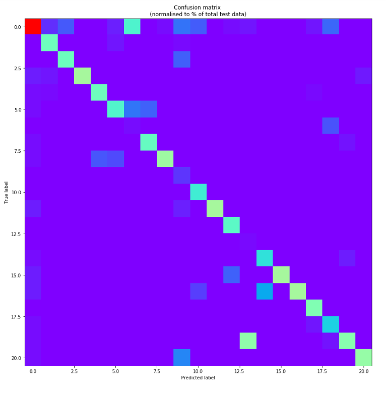

### SW-CNN method
 ### Confusion matrix and statistics of Validation for UOW dataset : 

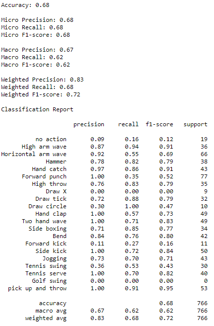

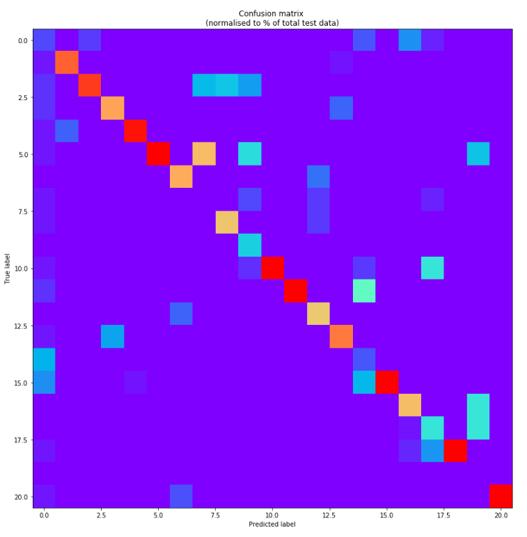

### Confusion matrix and statistics of Test for UOW dataset : 

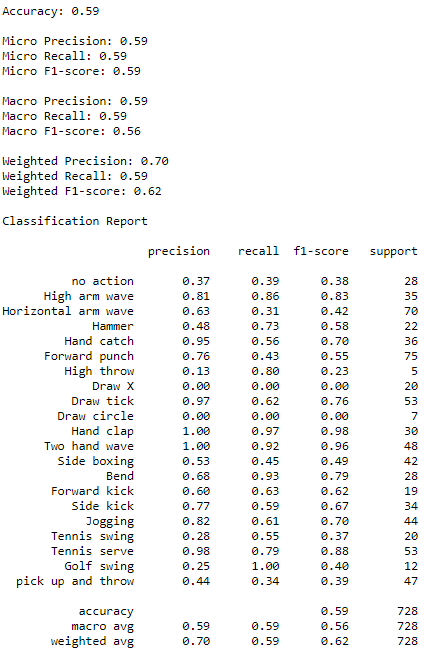

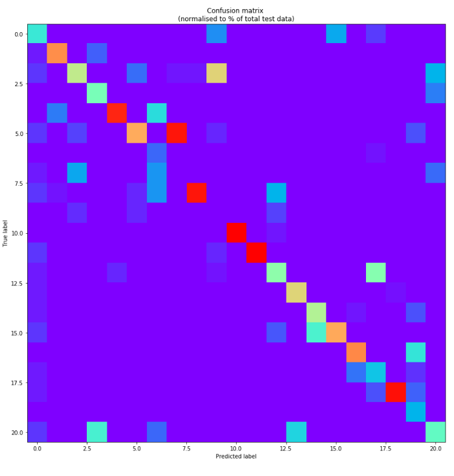

## Paper :

Mickael Delamare12, Cyril Laville1, Adnane Cabani2,Houcine Chafouk2.  

1[siatech](https://www.siatech.fr/) , IRSEEM, Rouen, France, Normandie Univ, UNIROUEN,mickael.delamare@siatech.fr   
2[ESIGELEC](http://www.esigelec.fr/) , IRSEEM, Rouen, France, Normandie Univ, UNIROUEN, adnane.cabani@esigelec.fr

How to cite :

>@article{delamare122021graph,
 > title={Graph Convolutional Networks Skeleton-based Action Recognition for Continuous Data Stream: A Sliding Window Approach},
 > author={Delamare12, Mickael and Laville, Cyril and Cabani, Adnane and Chafouk, Houcine},
 > year={2021}
>}

DOI : 10.5220/0010234904270435

LINK : https://www.scitepress.org/Papers/2021/102349/102349.pdf

Submitted to VISAPP Conference

## Code :
You will find in repository two files : 
  -Data Processing for OAD  
  -Data Processing for UOW action 3D dataset  
  -The algorithm trained for OAD (SW-GCN-OAD.pt)  
  -The algorthm trained fot UOW action 3D dataset (SW-GCN-UOW.pt)  
  -The algorithm trained for UOW action 3D dataset (SW-CNN.pt)
  
if you have any question don't hesitate to contact : delamare.mickael5@gmail.com

## Result demo in movie for OAD dataset :

